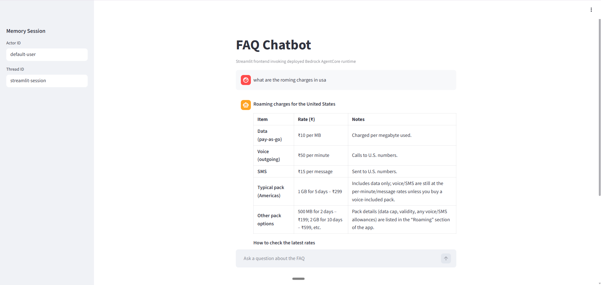
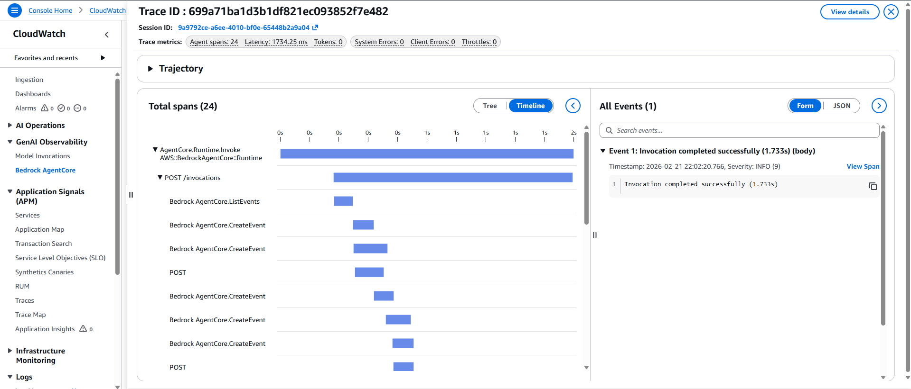

# Bedrock AgentCore Chatbot

FAQ chatbot powered by LangChain + LangGraph, deployed on **Amazon Bedrock AgentCore Runtime**, with a **Streamlit frontend** and **CloudWatch tracing**.


## Demo

### Streamlit UI


### CloudWatch Trace View


## Project Highlights

- FAQ retrieval with vector search (`FAISS` + sentence-transformers embeddings)
- Tool-using agent behavior for structured Q&A responses
- AgentCore memory-enabled runtime integration
- Streamlit chat app that invokes the **deployed runtime** (not local direct invoke)
- CloudWatch-compatible runtime invocation path for request tracing

## Project Structure

```text
.
|-- streamlit_app.py          # Streamlit frontend (invokes AgentCore runtime via boto3)
|-- agentcore_memory.py       # Memory-enabled AgentCore runtime entrypoint
|-- agentcore_runtime.py      # AgentCore runtime variant
|-- langgraph_agent.py        # Local LangGraph/agent variant
|-- lauki_qna.csv             # FAQ knowledge base
|-- .bedrock_agentcore.yaml   # AgentCore deployment/runtime metadata
|-- pyproject.toml            # Project dependencies
|-- assets/
|   |-- frontend_ui.png
|   `-- cloudwatch_trace.png
```

## Prerequisites

- Python `>=3.13`
- AWS credentials configured for the target account/region
- Access to Bedrock AgentCore runtime and memory resources
- `GROQ_API_KEY` and any required model/provider credentials in `.env`

## Quick Start

1. Install dependencies

```powershell
uv sync
```

2. Ensure environment variables are set (example)

```powershell
$env:AWS_REGION="us-west-2"
$env:AWS_DEFAULT_REGION="us-west-2"
$env:AGENT_RUNTIME_ARN="arn:aws:bedrock-agentcore:...:runtime/your-runtime-id"
```

3. Run the frontend

```powershell
uv run streamlit run streamlit_app.py
```

4. Open the app in your browser (typically `http://localhost:8501`)

## How It Works

1. User asks a question in Streamlit.
2. `streamlit_app.py` resolves AgentCore runtime ARN and region.
3. App calls `bedrock-agentcore:InvokeAgentRuntime` with:
   - `prompt`
   - `actor_id`
   - `thread_id`
4. Deployed runtime executes `agentcore_memory.py` agent flow.
5. Response is returned to UI and trace data is available in CloudWatch.

## Notes on Memory and Tracing

- `actor_id` and `thread_id` are captured in the UI sidebar for session continuity.
- Runtime calls are sent through AWS AgentCore API, enabling CloudWatch trace visibility.
- If traces do not appear, verify:
  - correct runtime ARN
  - runtime observability enabled in AgentCore config
  - IAM permissions for invoke and logging
  - matching AWS account and region

## Security Reminder

- Do not commit real secrets in `.env` (API keys/tokens).
- Rotate exposed keys and prefer AWS Secrets Manager or environment injection in deployment.
